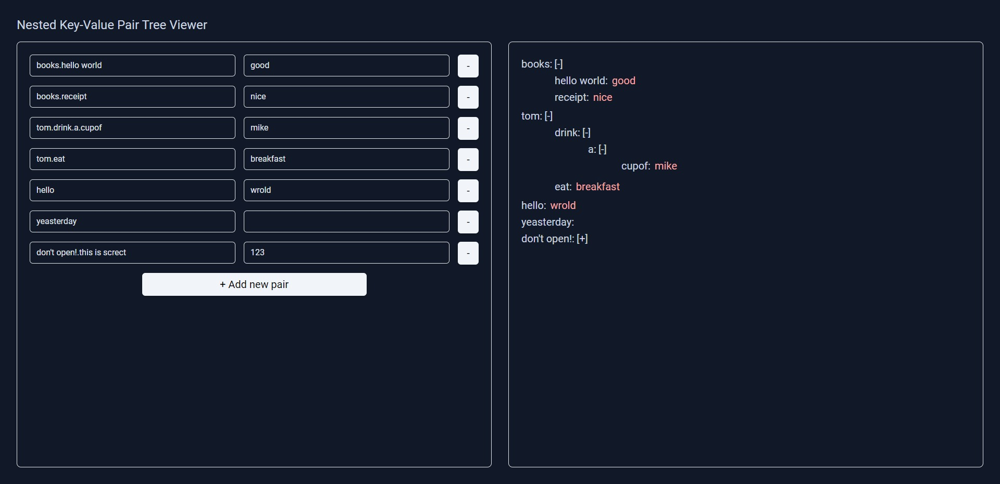

# Nested Key-Value Pair Tree Viewer

## Getting Started

### Installation

Install dependencies using yarn
```sh
yarn install
```

or using npm
```sh
npm install
```

## Usage

Run following command to build the bundle
```sh
yarn build
```

or using npm
```sh
npm run build
```


Then 
```sh
yarn preview
```

or
```sh
npm run preview
```

Open http://localhost:4173/ in your browser to see the result.

## Live Demo

https://df2qfzydlu86g.cloudfront.net/

## 專案心得
