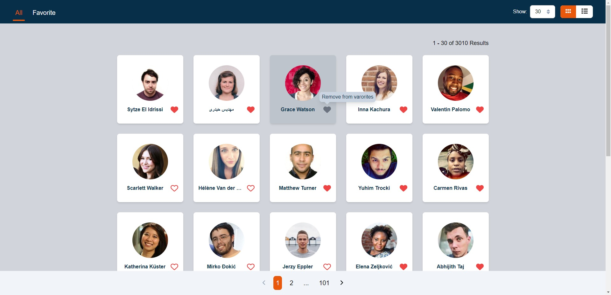

# Random User

## Getting Started

### Installation

Install dependencies using yarn
```
yarn install
```

or using npm
```
npm install
```

## Usage

Run following command to build the bundle
```
yarn build
```

or using npm
```
npm run build
```


Then 
```
yarn preview
```

or
```
npm run preview
```

Open http://localhost:4173/ in your browser to see the result.

## Live Demo
https://da3yga2cbwnl6.cloudfront.net/


## 專案心得
沒用過 Vue 和 Tailwind CSS，花了點時間研究語法和生態系統。以前也寫過一點點 Angular，覺得 Vue 寫起來和 Angular 蠻相似的，都是依靠 Template 和各種 Directive 去做畫面上的渲染和事件綁定，不像 React 是整套 JS 寫到底。

這份測驗的難點我認為在於儲存這件事，分成瀏覽狀態儲存和收藏資料儲存。

### 瀏覽狀態儲存
要達成 State 在 Refresh 後不會變更我想到兩種做法：
1. 使用 LocalStorage 儲存 state，refresh 後從 Localstorage 中取出回復。
2. 把 state 變成 query string 存在 url 上，refresh 後從 url 取對應的 query string 回復 state。

經過考慮後覺得第二種做法比較合理一點，因為使用者應該只是想要 refresh 後狀態不變，而不是每次進入網站都會保留上次的瀏覽狀態，因此加入 Vue router 去做路由切換順便更新 url。

### 收藏儲存
因為 Random user api 雖然可以使用 seed 去讓搜尋結果固定，但每次的列表查詢我只能拿到該列表的 seed 而沒辦法得到個別使用者的 seed，因此沒辦法單獨儲存使用者 id 來查詢個別使用者資料。
所以我使用 LocalStorage 將收藏存成 JSON 格式去做管理，另外也記錄每一頁的 seed 讓每次的查詢結過一致。

另外使用 pinia 做 state store，目的是讓收藏的 state 這件事可以跨頁連動，也能針對收藏的刪減即時更新表單。